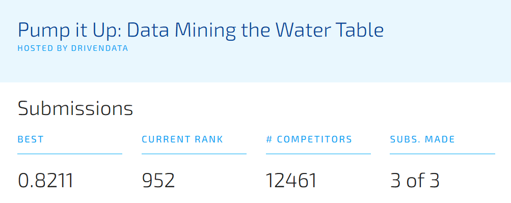

# Pump-it-Up---Driven-Data

Github repo link: https://github.com/thuvarahan97/Pump-it-Up---Driven-Data

## Import Libraries and Dataset

* Required libraries are loaded.
* Train dataset, test dataset, train labels and submission format are loaded from csv files.
* Size of train dataset and test dataset are analyzed.

## Preprocessing

### Initiating the preprocessing task

* At first, 'id' is set as the index of train data and test data.
* Count of train labels are plotted in a bar graph, and it shows that the train data is unbalanced.

### Checking distribution of features with train labels

* Count of 'status_group' values for some of the columns of the train data are plotted to check the distribution of data.

### Removing duplicate values from "installer" and "funder" columns

* In both train data and test data, the 'installer' column values have duplicates with captial and small letters, extra spaces, and forward and backward slashes. Thus, the values of 'installer' column are trimmed, splitted by spaces, first element of the splitted output array is obtained, and "/" and "\" are replaced.
* Furthermore, the 'installer' column values have only very small count for many values compared to the maximum count in the column. Therefore, the values with count less than 100 are replaced with "other".
* Similarly, the 'funder' column values have only very small count for many values compared to the maximum count in the column. Therefore, the values with count less than 100 are replaced with "other".

### Handling missing data

* Count of null values in each column in train and test data are checked.
* Seperate graphs for train and test data are plotted showing percentage for each columns with missing data.

* All the columns with named string values are encoded as numbers using Label Encoding, before filling some of the columns with missing data.
  * The columns are 'funder', 'installer', 'wpt_name', 'basin', 'subvillage', 
                  'region', 'lga', 'ward', 'public_meeting', 'recorded_by', 
                  'scheme_management', 'permit', 'extraction_type', 
                  'extraction_type_group', 'extraction_type_class', 'management',
                  'management_group', 'payment', 'payment_type', 'water_quality',
                  'quality_group', 'quantity', 'quantity_group', 'source', 'source_type',
                  'source_class', 'waterpoint_type', and 'waterpoint_type_group'.
* According to the plotted graph, the columns such as 'scheme_name', 'scheme_management', 'installer', 'funder', 'public_meeting', 'permit' and 'subvillage' have null values. Among them, "scheme_name" column has null values of about 50% of all the missing column values, which is much higher percentage compared to other missing columns. Therefore, "scheme_name" is dropped from the train and test data.
* Then, 'scheme_management', 'installer', 'funder', 'public_meeting', 'permit' and 'subvillage' are filled with their respective median values in both train and test data.

### Removing outliers

* It is identified that 'latititude', 'longitude' and 'gps_height' columns have outliers where the 'longitude' and 'gps_height' have negative values. The 'latitude' column values that correspond to 'longitude' negative values too are unreal values which are nearly 0.
* 'latitude' values that correspond to the 'longitude' values which are less than 1, are set as null at first and then, grouped by 'region_code' and the null values in the 'latitude' are filled with the mean values of each group.
* 'longitude' values which are less than 1, are set as null and then, grouped by 'region_code' and the null values in the 'longitude' are filled with the mean values of each group.
* 'gps_height' values which are less than 1, are set as null and then, grouped by 'region_code' and the null values in the 'gps_height' are filled with the mean values of each group.
* The missing data count is again checked, and the null values which are still in the 'gps_height' column are filled with the mean value of the column.
* Then, 'construction_year' are identified to have 0 values. They are replaced with a value (1950) lower than the actual year minimum value (1960) in the column, assuming that the records were not made for the 'construction_year' before 1960.

### Analyzing column relationships based on dates

* "date_recorded" is obtained in datetime format.
* "construction_year" too is converted from year value to datetime format.
* A new "period" column is defined which means how long the pumps are kept planted, that is the time period between the constructed year and the last date the record was made.
* At first, the "period" is calculated by finding the difference between "construction_year" and "date_recorded".
* The obtained "period" values are converted to numeric values (timedelta64[D]).
* The "period" negative values replaced with the mean of non-negative values.
* Since the "period" values are distributed in wide range of numeric values, they are obtained into 5 bins, and label encoded.
* The "construction_year" and "date_recorded" columns are dropped from train and test datasets.

### Analyzing correlation between features

* Using Pearson Correlation, heatmap is plotted.
 

* 4 features such as 'extraction_type_group', 'quantity_group', 'source_type' and 'waterpoint_type_group' are identified to be the highly correlated features for the threshhold 0.85, and they are dropped from train and test datasets.

### Removing unimportant features 

* From data analysis and findings from early model training processes, columns such as 'recorded_by', 'water_quality', 'payment_type', 'num_private', 'installer' and 'funder' are dropped from both train and test datasets.
* Here, 'num_private' is not clearly mentioned about its significance in the description of the competition and it has many 0 values which makes no sense.
* 'installer' and 'funder' too are found to be not important by the analysis made on many model training processes.
* 'payment_type', 'water_quality' and 'recorded_by' features does not affect the pump condition in real world.

### Performing One-Hot Encoding

* 'payment','source_class', 'permit' and 'quantity' are one-hot encoded in the combined train and test dataset.
* After that, the combined train and test data are obtained seperately again.

### Splitting the train dataset for evaluation purposes

* 'status_group' train label is obtained in y_train and the train data is obtained in X_train.
* The train dataset is splitted with test size of 0.2 and random state of 10.

### Handling the unbalanced train data

* SMOTE is used to oversample the train dataset.
* However, ADASYN, SMOTE+Tomek and SMOTE+Ensemble too were involved earlier to oversample the train dataset. But, SMOTE gave good result with better accuracy.
* X_train is again created using pandas dataframe to retain the columns even after oversampling, which helps to avoid errors during model training processes.

## Model Training

* Decision Tree, Random Forest, XGBoost and CatBoost classifiers have been used to train and evaluate the model seperately.
* After the model were trained, a seperate graph for each model is plotted to display the features ordered based on their importance in the training process.

## Model Predictions

* Predictions for the kept-aside evaluation dataset are obtained for each trained model.
* Based on the predicitons, a confusion matrix and a classification report showing f1-scores are generated for each model.
* In all the attempts of preprocessing, training and prediction processes, Random Forest Classifier gave better accuracy than the other classifiers.
* Random Forest Classifier has given 0.84 accuracy with oob score of 0.8595 in the last attempt.
* Therefore, Random Forest Classifier has been chosen for the model predictions of test dataset for the submission.
* Finally, the model is trained on full train dataset without splitting, and predictions are obtained for test dataset.

 

